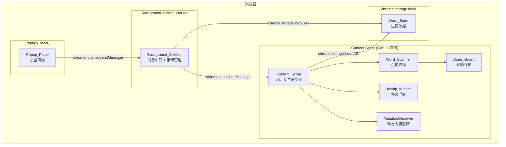

# 技术设计文档 — LinguaVeil v0.1.0

## 概述

LinguaVeil v0.1.0 是一个基于 WXT + React + TypeScript 的 Chrome 浏览器扩展 MVP，聚焦于 GitHub 页面上的英文生词识别与标注。扩展采用浏览器扩展的三层架构（Content Script / Popup / Background），通过 Content Script 注入 GitHub 页面，在 `#readme .markdown-body` 区域内扫描英文文本，识别生词并以下划线样式标注，同时提供 hover 释义浮窗。Popup 面板提供学习模式开关控制，Background Service 负责消息中转和存储管理。

核心设计目标：

- 仅在 GitHub 页面激活，最小化对用户浏览体验的干扰
- 保护代码区域（`<code>`, `<pre>`, `<script>`, `<style>`, LaTeX）不被标注
- 区分普通生词（灰色虚线）和技术生词（蓝色实线）
- 适配 GitHub PJAX/Turbo 动态导航

## 架构

### 整体架构



### 模块职责

| 模块               | 运行环境                    | 职责                                         |
| ------------------ | --------------------------- | -------------------------------------------- |
| Content_Script     | GitHub 页面                 | 入口初始化、生词扫描调度、DOM 标注、事件监听 |
| Word_Scanner       | GitHub 页面                 | 遍历 DOM 文本节点、提取英文单词、匹配生词库  |
| Code_Guard         | GitHub 页面                 | 判断 DOM 节点是否属于代码保护区域            |
| Tooltip_Widget     | GitHub 页面                 | 渲染 hover 释义浮窗、管理浮窗定位和生命周期  |
| Popup_Panel        | 扩展 Popup                  | React 设置面板、模式开关、状态持久化         |
| Background_Service | Service Worker              | 消息转发、错误处理                           |
| Word_Store         | 共享（通过 chrome.storage） | 生词数据 CRUD、已掌握词汇管理                |

### 文件结构

```
entrypoints/
├── content.ts                  # Content Script 入口
├── content/
│   ├── scanner.ts              # Word_Scanner 模块
│   ├── code-guard.ts           # Code_Guard 模块
│   ├── tooltip.ts              # Tooltip_Widget 模块
│   ├── observer.ts             # MutationObserver 管理
│   └── styles.css              # 注入样式（下划线 + 浮窗）
├── background.ts               # Background Service 入口
├── popup/
│   ├── App.tsx                 # Popup 主组件
│   ├── main.tsx                # Popup 入口
│   └── index.html              # Popup HTML
└── lib/
    ├── word-store.ts           # Word_Store 存储模块
    ├── messages.ts             # 消息类型定义
    └── tech-words.ts           # 预定义技术词汇表
```

## 组件与接口

### 1. Code_Guard 模块

```typescript
// entrypoints/content/code-guard.ts

/** 需要跳过的标签名集合 */
const SKIP_TAGS = new Set(["CODE", "PRE", "SCRIPT", "STYLE"]);

/** LaTeX 公式正则：匹配 $...$ 和 $$...$$ */
const LATEX_PATTERN = /\$\$[\s\S]+?\$\$|\$[^$\n]+?\$/g;

/**
 * 判断一个 DOM 节点是否处于代码保护区域内
 * 向上遍历祖先节点，检查是否包含 SKIP_TAGS 中的标签
 */
export function isProtectedNode(node: Node): boolean;

/**
 * 从文本中移除 LaTeX 公式部分，返回可扫描的文本片段
 * 返回 { text: string, ranges: Array<{ start: number, end: number }> }
 * ranges 表示原始文本中可扫描的区间
 */
export function extractScannableText(text: string): {
  segments: Array<{ text: string; offset: number }>;
};
```

### 2. Word_Scanner 模块

```typescript
// entrypoints/content/scanner.ts

/** 英文单词提取正则：连续字母序列，长度 >= 3 */
const WORD_PATTERN = /[a-zA-Z]{3,}/g;

/** 数字混合字符串检测 */
const HAS_DIGIT = /\d/;

export interface ScanResult {
  word: string;
  type: "ordinary" | "technical";
  node: Text;
  offset: number;
}

/**
 * 扫描指定容器内的所有文本节点，返回需要标注的生词列表
 * 1. 使用 TreeWalker 遍历文本节点
 * 2. 通过 Code_Guard 过滤受保护节点
 * 3. 提取英文单词并匹配生词库
 * 4. 对生词进行分级（普通/技术）
 */
export function scanContainer(
  container: Element,
  masteredWords: Set<string>,
  techWords: Set<string>,
): ScanResult[];

/**
 * 对扫描结果执行 DOM 标注
 * 将生词包裹在 <span class="wl-word" data-word="xxx"> 中
 */
export function annotateWords(results: ScanResult[]): void;

/**
 * 移除容器内所有生词标注，恢复原始文本
 */
export function removeAnnotations(container: Element): void;
```

### 3. Tooltip_Widget 模块

```typescript
// entrypoints/content/tooltip.ts

export interface TooltipData {
  word: string;
  definition: string;
  partOfSpeech: string;
  type: "ordinary" | "technical";
}

/**
 * 初始化 Tooltip 系统
 * - 创建全局唯一的浮窗 DOM 元素
 * - 绑定 mouseenter/mouseleave 事件委托
 */
export function initTooltip(): void;

/**
 * 显示浮窗
 * - 计算位置（基于目标元素的 getBoundingClientRect）
 * - 视口边界检测与位置调整
 * - 设置 z-index 为 2147483647（最大值）
 */
export function showTooltip(target: HTMLElement, data: TooltipData): void;

/**
 * 隐藏浮窗（200ms 延迟，支持鼠标移入浮窗取消隐藏）
 */
export function hideTooltip(): void;

/**
 * 销毁 Tooltip 系统，移除 DOM 和事件监听
 */
export function destroyTooltip(): void;
```

### 4. Word_Store 模块

```typescript
// entrypoints/lib/word-store.ts

export interface WordEntry {
  word: string;
  definition: string;
  partOfSpeech: string;
  type: "ordinary" | "technical";
  firstSeen: number; // Unix timestamp
  mastered: boolean;
}

/**
 * 获取已掌握词汇列表
 */
export async function getMasteredWords(): Promise<Set<string>>;

/**
 * 将单词标记为已掌握
 */
export async function markAsMastered(word: string): Promise<void>;

/**
 * 保存/更新生词条目
 */
export async function saveWord(entry: WordEntry): Promise<void>;

/**
 * 按掌握状态查询生词列表
 */
export async function queryWords(filter: {
  mastered?: boolean;
}): Promise<WordEntry[]>;
```

### 5. 消息通信接口

```typescript
// entrypoints/lib/messages.ts

/** 消息类型定义 */
export type Message =
  | { type: "LEARNING_MODE_CHANGED"; enabled: boolean }
  | { type: "MARK_MASTERED"; word: string }
  | { type: "GET_WORD_DATA"; word: string }
  | { type: "WORD_DATA_RESPONSE"; data: WordEntry | null };

/**
 * Popup -> Background: 发送学习模式变更
 */
export function sendModeChange(enabled: boolean): Promise<void>;

/**
 * Background -> Content Script: 转发消息到活动标签页
 */
export function forwardToActiveTab(message: Message): Promise<void>;
```

### 6. MutationObserver 管理

```typescript
// entrypoints/content/observer.ts

/**
 * 启动对目标容器的 MutationObserver 监听
 * - 监听 childList 和 subtree 变化
 * - 500ms 防抖后触发回调
 */
export function startObserving(onContentChange: () => void): void;

/**
 * 停止监听并清理资源
 */
export function stopObserving(): void;
```

### 7. Popup_Panel 组件

```typescript
// entrypoints/popup/App.tsx

interface ModeState {
  learning: boolean;
  writing: boolean; // v0.1.0 禁用
  translation: boolean; // v0.1.0 禁用
}

/**
 * Popup 主组件
 * - 从 chrome.storage 读取模式状态
 * - 渲染三个模式开关
 * - 学习模式切换时发送消息并持久化
 * - 写作/翻译模式显示为禁用 + "即将推出"
 */
```
